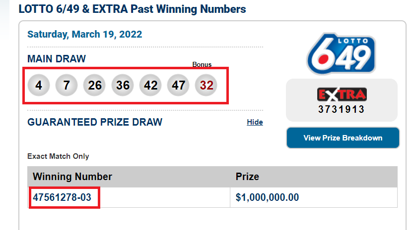

# lottery_checker
This is one of the first practical projects that I ever completed.

I had a 6/49 lottery subscription where I played the same numbers every draw, and I wanted a way to know whether I won each draw. (Spoiler, I didn't win the big one <=*^( )

## Key takeaways
As a first project, most of this was done step-by-step using stack overflow and Google.

Coming into the project, I knew a bit about beautiful soup.

I learned the following during the project:
-how to run the script on Heroku using a scheduler
-how to connect and write to pgadmin
-how to use definitions to break down my program into pieces
-I created a class for the first time - didn't really understand much as I was doing it